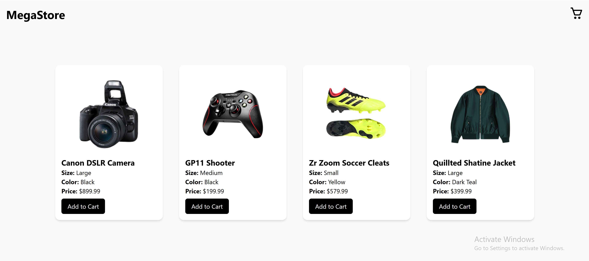
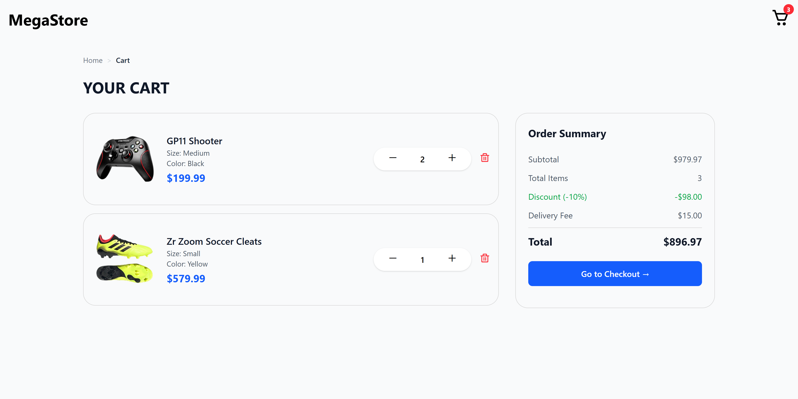
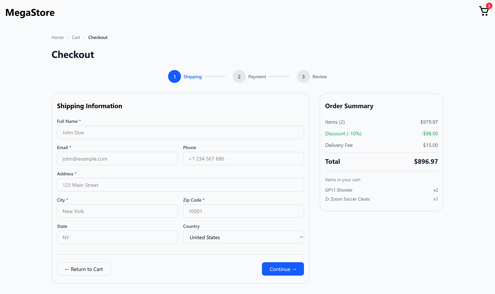
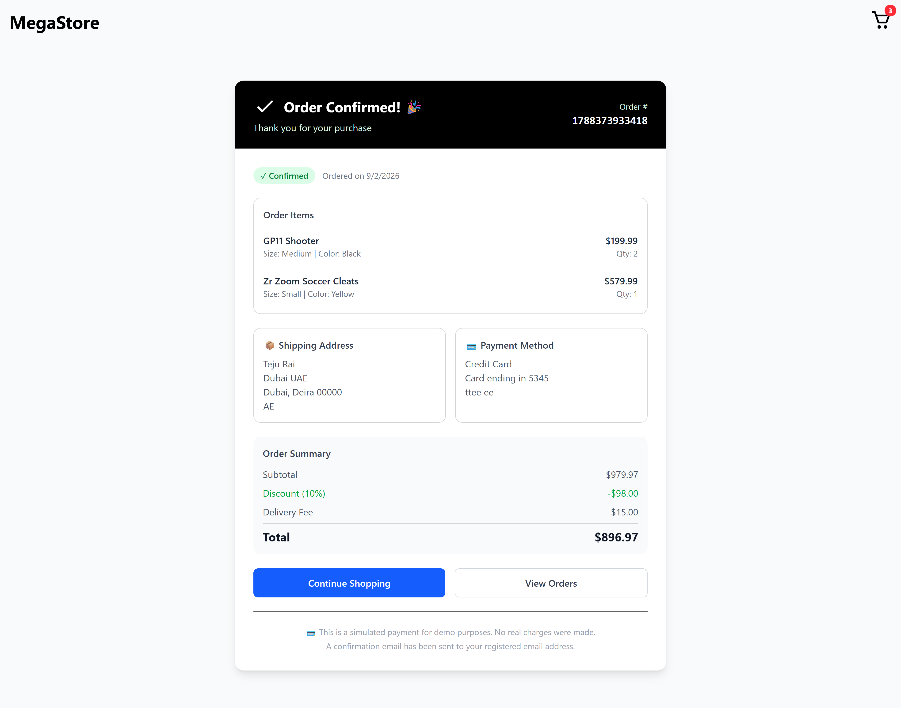
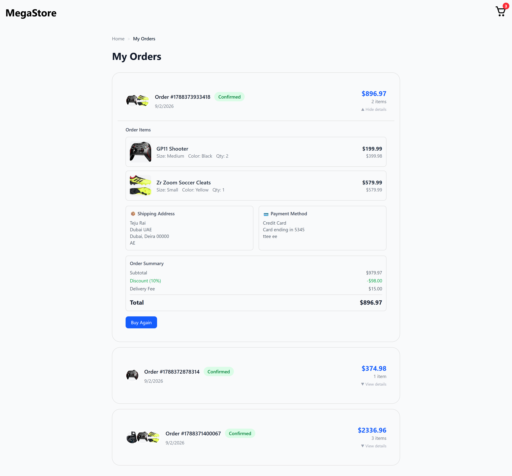

# 🛒 MegaStore - React E-Commerce Cart & Checkout

A fully functional e-commerce shopping cart and checkout system built with React, Tailwind CSS, and React Router.

## ✨ Features

- 🛍️ **Product Listing** - Browse products with images, sizes, colors, and prices
- 🛒 **Shopping Cart** - Add/remove items, update quantities, and view cart summary
- 📦 **Multi-Step Checkout** - Three-step process: Shipping → Payment → Review
- ✅ **Form Validation** - Required fields with error messages
- 💰 **Dynamic Calculations** - Subtotal, discount (10%), delivery fee, and total
- 📱 **Fully Responsive** - Works on all devices (mobile, tablet, desktop)
- 📝 **Order History** - View past orders with expandable details
- 💳 **Simulated Payment** - Demo payment processing with loading states
- 🎯 **Order Confirmation** - Professional thank you page with order details

## 🛠️ Tech Stack

- **React 18** - UI Library
- **Vite** - Build Tool
- **React Router DOM** - Navigation & Routing
- **Tailwind CSS** - Styling
- **Context API** - State Management
- **Local Storage** - Data Persistence

## 📁 Project Structure

```
megastore-cart-react/
├── screenshots/             # Project screenshots
├── src/
│   ├── assets/
│   │   └── images/          # Product images
│   ├── components/
│   │   ├── CartItem.jsx     # Individual cart item
│   │   ├── CartSummary.jsx  # Order summary component
│   │   ├── Header.jsx       # Navigation header
│   │   └── ProductCard.jsx  # Product display card
│   ├── context/
│   │   ├── CartContext.jsx  # Cart state provider
│   │   └── CartReducer.jsx  # Cart state reducer
│   ├── data/
│   │   └── product.jsx      # Product data
│   ├── pages/
│   │   ├── Home.jsx         # Product listing page
│   │   ├── Cart.jsx         # Shopping cart page
│   │   ├── Checkout.jsx     # Multi-step checkout
│   │   ├── OrderConfirmation.jsx  # Order success page
│   │   └── Orders.jsx       # Order history page
│   ├── App.jsx              # Main app with routes
│   ├── main.jsx             # Entry point
│   └── index.css            # Tailwind styles
├── .gitignore
├── index.html
├── package.json
├── README.md
├── vite.config.js
└── eslint.config.js
```

## 🚀 Installation & Setup

### Prerequisites

- Node.js (v16 or higher)
- npm or yarn

### Steps

```bash
# 1. Clone the repository
git clone https://github.com/raiteju/megastore-cart-react.git

# 2. Navigate to project directory
cd megastore-cart-react

# 3. Install dependencies
npm install

# 4. Start development server
npm run dev

# 5. Open your browser and visit
# http://localhost:5173
```

### Build for Production

```bash
# Create production build
npm run build

# Preview production build
npm run preview
```

## 📸 Screenshots

| Home Page | Cart Page | Checkout |
|-----------|-----------|----------|
|  |  |  |

| Order Confirmation | Order History |
|--------------------|---------------|
|  |  |

## 🎯 Key Functionality

### Cart Management
- Add items to cart with quantity tracking
- Increase/decrease item quantities
- Remove items from cart
- Cart badge showing total items

### Checkout Process
1. **Step 1: Shipping Information** - Collect customer details
2. **Step 2: Payment Method** - Simulated card payment
3. **Step 3: Review Order** - Confirm all details before placing

### Order Management
- Orders saved in localStorage
- View order history with expandable details
- Order confirmation with all details

## 📝 Future Enhancements

- [ ] Real payment gateway integration (Stripe/PayPal)
- [ ] User authentication and accounts
- [ ] Backend API with database storage
- [ ] Product search and filtering
- [ ] Product categories
- [ ] Wishlist functionality
- [ ] Email notifications
- [ ] Admin dashboard for product management

## 🤝 Contributing

1. Fork the repository
2. Create your feature branch (`git checkout -b feature/AmazingFeature`)
3. Commit your changes (`git commit -m 'Add some AmazingFeature'`)
4. Push to the branch (`git push origin feature/AmazingFeature`)
5. Open a Pull Request

## 📄 License

MIT © Teju Rai

## 🙏 Acknowledgments

- [React](https://reactjs.org/)
- [Tailwind CSS](https://tailwindcss.com/)
- [Vite](https://vitejs.dev/)
- [React Router](https://reactrouter.com/)
- [BoxIcons](https://boxicons.com/)

## 📬 Contact

- GitHub: [@raiteju](https://github.com/raiteju)
- Project Link: [https://github.com/raiteju/megastore-cart-react](https://github.com/raiteju/megastore-cart-react)

---

**Made with ❤️ by Teju Rai**